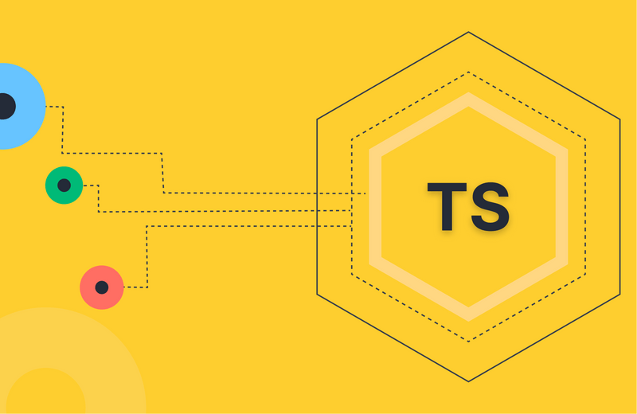

# Documentation sur la Programmation Orientée Objet (POO)

## Description

Cette documentation personnelle couvre les concepts fondamentaux de la Programmation Orientée Objet (POO) avec typeScript. Elle inclut des explications sur les principaux piliers de la POO, ainsi que des exemples pratiques en TypeScript. Ce référentiel est conçu pour aider à comprendre et à appliquer les concepts de la POO dans des projets de développement.

## Structure de la Documentation

### 1. Programmation Orientée Objet (POO)

#### Définition

La POO est un paradigme de programmation centré autour des objets plutôt que des fonctions.

#### Les 4 piliers de la POO

1. **Encapsulation**
2. **Abstraction**
3. **Héritage**
4. **Polymorphisme**

### 3. Exemple d'un objet : téléphone

### 4. Modificateurs de Visibilité

### 5. Collection de Tuples

### 6. Ressources en Français

## Utilisation de la Documentation

Cette documentation est disponible sur GitHub et peut être consultée à tout moment pour revoir les concepts fondamentaux de la POO et des exemples pratiques en TypeScript.

## Auteur

Auteur : LuisMiLR  
Date de création : 01.07.2024
